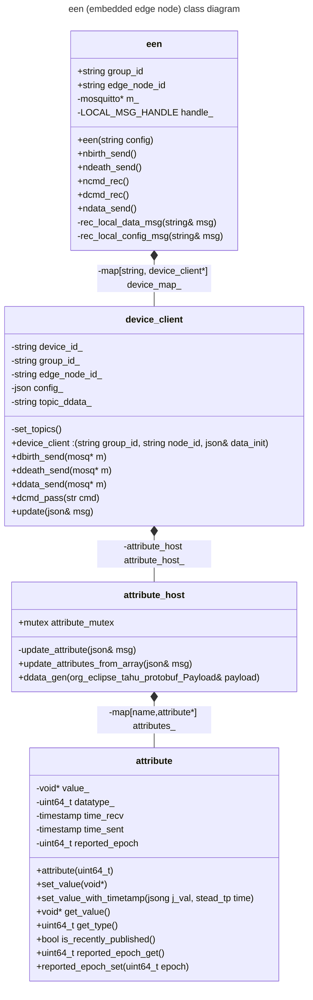

# een (embedded edge node)

```mermaid
---
title: een (embedded edge node) class diagram
---
classDiagram

class een{
  +string group_id
  +string edge_node_id
  -mosquitto* m_
  -LOCAL_MSG_HANDLE handle_
  +een(string config)
  +nbirth_send()
  +ndeath_send()
  +ncmd_rec()
  +dcmd_rec()
  +ndata_send()
  -rec_local_data_msg(string& msg)
  -rec_local_config_msg(string& msg)
}

class device_client{
  -string device_id_
  -string group_id_
  -string edge_node_id_
  -json config_
  -string topic_ddata_
  -set_topics()

  +device_client : (string group_id, string node_id, json& data_init)
  +dbirth_send(mosq* m)
  +ddeath_send(mosq* m)
  +ddata_send(mosq* m)
  +dcmd_pass(str cmd)
  +update(json& msg)
}
een *-- device_client : -map[string, device_client*] device_map_

class attribute_host{
  +mutex attribute_mutex
  -update_attribute(json& msg)
  +update_attributes_from_array(json& msg)
  +ddata_gen(org_eclipse_tahu_protobuf_Payload& payload)
}
device_client *-- attribute_host : -attribute_host attribute_host_

class attribute{
  -void* value_
  -uint64_t datatype_
  -timestamp time_recv
  -timestamp time_sent
  -uint64_t reported_epoch
  +attribute(uint64_t)
  +set_value(void*)
  +set_value_with_timetamp(jsong  j_val, stead_tp time)
  +void* get_value()
  +uint64_t get_type()
  +bool is_recently_published()
  +uint64_t reported_epoch_get()
  +reported_epoch_set(uint64_t epoch)
}
attribute_host *-- attribute : -map[name,attribute*] attributes_
```